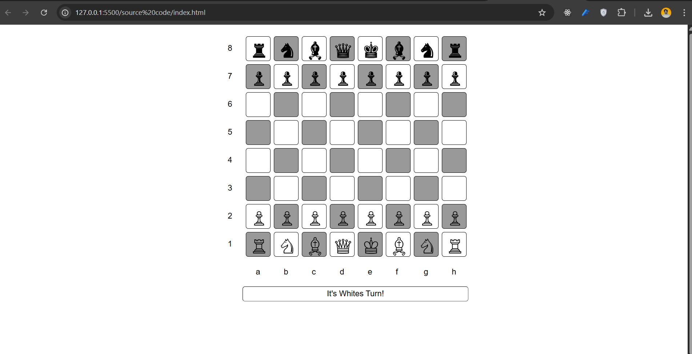

# JavaScript Chess Game

A simple chess game built using HTML, CSS, and JavaScript.

## Game Preview

## Features
- Interactive chess board
- Turn-based gameplay
- Piece movement validation
- Simple UI

## Technologies Used
- HTML
- CSS
- JavaScript
